<div align="center">

# Client Says

Type the time a client mentioned and see it in the timezones you work with. DST applied for today's date, shareable link, no install.

[![Live][badge-site]][url-site]
[![HTML5][badge-html]][url-html]
[![CSS3][badge-css]][url-css]
[![JavaScript][badge-js]][url-js]
[![Claude Code][badge-claude]][url-claude]
[![License][badge-license]](LICENSE)

[badge-site]:    https://img.shields.io/badge/live_site-0063e5?style=for-the-badge&logo=googlechrome&logoColor=white
[badge-html]:    https://img.shields.io/badge/HTML5-E34F26?style=for-the-badge&logo=html5&logoColor=white
[badge-css]:     https://img.shields.io/badge/CSS3-1572B6?style=for-the-badge&logo=css3&logoColor=white
[badge-js]:      https://img.shields.io/badge/JavaScript-F7DF1E?style=for-the-badge&logo=javascript&logoColor=black
[badge-claude]:  https://img.shields.io/badge/Claude_Code-CC785C?style=for-the-badge&logo=anthropic&logoColor=white
[badge-license]: https://img.shields.io/badge/license-MIT-404040?style=for-the-badge

[url-site]:   https://clientsays.neorgon.com/
[url-html]:   #
[url-css]:    #
[url-js]:     #
[url-claude]: https://claude.ai/code

</div>

---

A two-page tool for remote teams. Type the time a client mentioned and see it in the places you work with, Chile, Colombia and Mexico by default, with DST applied for today's date. The second page translates corporate jargon into what it actually means.

**Live:** [clientsays.neorgon.com](https://clientsays.neorgon.com/) · runs entirely in the browser, no build step, no backend.

---

## What it does

Enter the time and timezone a client used (say *"3 PM ET"*) and the page shows it in every destination you have picked. Out of the box that is Chile (`America/Santiago`), Colombia (`America/Bogota`) and Mexico (`America/Mexico_City`). **Edit destinations** opens a searchable list of 44 places, cards drag to reorder, and the list is kept in this browser.

---

## Features

- **Searchable timezone picker**: type to filter by name, city, abbreviation, or alias (see table below). Arrow keys, Enter, and Tab all work.
- **Abbreviation aliases**: clients say things like "ET" instead of "EST". The search understands both.
- **Pick destinations**: 44 places, searched by country, city or timezone id, dragged into the order you want.
- **Day badge**: each card says same day, next day or previous day, so a 9 PM call does not land on the wrong date.
- **Settings remembered**: your last time, timezone, 12h/24h choice and destination list are saved in `localStorage` and restored on the next visit.
- **Share link**: copies a URL with the time, AM/PM, source timezone and format as query params. Destinations are not in the link, so whoever opens it sees their own.
- **Copy per card**: clipboard button on each result card.
- **Now button**: resets the inputs to your current local time in one click.
- **Hour stepper and A/P keys**: the arrows either side of the hour nudge it up or down, and with the AM/PM button focused, `A` and `P` set it directly.
- **12h / 24h toggle**: switch output format on every card.
- **DST-aware**: uses the browser's built-in IANA timezone database, so offsets are always correct for today's date.

---

## Timezone search aliases

The picker matches on timezone ID, city name, full name, live abbreviation (e.g. `EDT` in summer, `EST` in winter), and these common informal terms:

| Timezone | Aliases you can type |
|----------|----------------------|
| Eastern Time (New York) | `ET` `EST` `EDT` `eastern` `east coast` |
| Central Time (Chicago) | `CT` `CST` `CDT` `central` |
| Mountain Time (Denver) | `MT` `MST` `MDT` `mountain` |
| Pacific Time (Los Angeles) | `PT` `PST` `PDT` `pacific` `west coast` |
| Arizona (no DST) | `MST` `arizona` `az` |
| Alaska | `AKST` `AKDT` `alaska` |
| Hawaii | `HST` `hawaii` |
| UTC / GMT | `UTC` `GMT` `zulu` `z` `universal` |
| United Kingdom | `GMT` `BST` `uk` `gb` `britain` |
| Central Europe (Paris, Madrid, Berlin) | `CET` `CEST` |
| Russia (Moscow) | `MSK` |
| UAE (Dubai) | `GST` `gulf` |
| India | `IST` `india` `mumbai` |
| Japan | `JST` `japan` |
| Singapore | `SGT` |
| Australia (Sydney) | `AEST` `AEDT` `aus` |
| New Zealand | `NZST` `NZDT` `nz` |
| Chile | `CLT` `CLST` |
| Colombia | `COT` |
| Peru / Ecuador | `PET` |
| Venezuela | `VET` |
| Mexico (CDMX) | `CST` `CDT` `mx` `cdmx` |
| Brazil (São Paulo) | `BRT` `BRST` `brasil` |
| Argentina | `ART` `bsas` `ba` |

---

## Architecture



```
client-says-site/
├── index.html          # Timezone converter app shell
├── css/
│   └── style.css       # All styles
├── js/
│   ├── app.js          # Entry point
│   ├── state.js        # Timezone + localStorage
│   ├── render.js       # Result cards
│   ├── events.js       # Search, share, copy, now button
│   └── utils.js        # Helpers
└── jargon/
    └── index.html      # Jargon translator, single file
```

---

## Running locally

```bash
make serve   # http://localhost:8803
```

The converter uses ES modules, so it needs an HTTP server. The jargon page is one self-contained file and opens directly.

---

## Tech

Pure HTML + CSS + JavaScript. Conversion uses the [ECMAScript Internationalization API](https://developer.mozilla.org/en-US/docs/Web/JavaScript/Reference/Global_Objects/Intl) (`Intl.DateTimeFormat`) which ships with every modern browser and is backed by the IANA timezone database.

---

<div align="center">
  <sub>Part of <a href="https://neorgon.com">Neorgon</a></sub>
</div>
